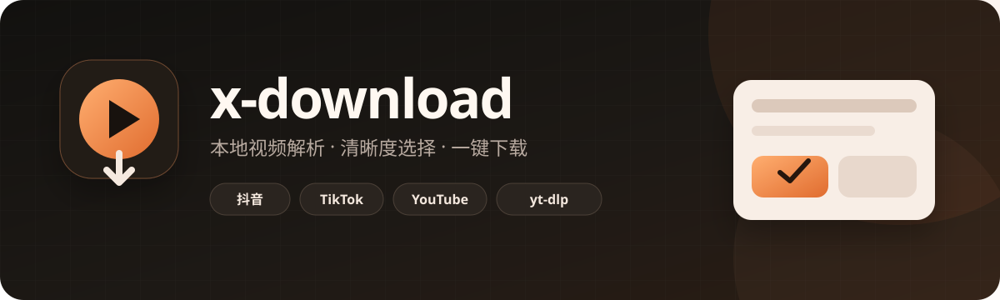
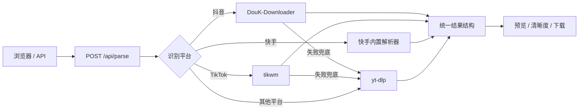

<div align="center">
  

  <br>

  <a href="https://www.python.org/"></a>
  <a href="https://fastapi.tiangolo.com/"></a>
  <a href="https://github.com/JoeanAmier/TikTokDownloader"></a>
  <a href="https://github.com/yt-dlp/yt-dlp"></a>
  

  <h3>粘贴链接，解析作品信息，选择清晰度，一键预览或下载。</h3>
  <p>抖音 · TikTok · YouTube · Bilibili · X · Instagram 以及更多 yt-dlp 支持的平台</p>

  <p>
    <a href="#-快速开始"><b>快速开始</b></a> ·
    <a href="#-cookie-配置"><b>Cookie 配置</b></a> ·
    <a href="#-api"><b>API</b></a> ·
    <a href="#-常见问题"><b>常见问题</b></a> ·
    <a href="#-支持项目"><b>支持项目</b></a>
  </p>
</div>

> [!NOTE]
> x-download 是本地运行的解析服务。Cookie 保存在你的设备上，页面和 API 默认仅监听 `127.0.0.1:18111`。

## ✨ 功能亮点

| | 能力 | 说明 |
|:---:|---|---|
| 🎬 | 多平台解析 | 抖音使用 DouK-Downloader；TikTok 使用 tikwm；其他平台交给 yt-dlp |
| 👤 | 完整作品信息 | 作者头像、名称、账号 ID、UID、主页、简介、视频文案和互动数据 |
| 🎚️ | 清晰度按钮 | 同分辨率重复档位自动合并，保留综合质量更合适的版本 |
| 📦 | 文件大小 | 优先显示精确大小，也可根据码率和时长显示估算值 |
| 📊 | 实时下载进度 | 分轨下载时展示百分比、速度、剩余时间与音视频合并状态 |
| ▶️ | 本地预览 | 清晰度按钮会同步更新预览、下载地址和媒体直链 |
| 🖼️ | 图集支持 | 自动识别并展示抖音图集作品 |
| 🔐 | Cookie 支持 | 支持抖音/TikTok 请求 Cookie 和 yt-dlp Netscape Cookie 文件 |
| 🚀 | 一键启动 | 自动创建虚拟环境、安装依赖、克隆上游并打开页面 |

### 解析结果

- **抖音**：作者资料、视频文案、点赞、评论、收藏、分享、清晰度、帧率和文件大小。
- **快手**：内置移动分享页解析，支持作者、头像、文案、播放、点赞、评论、分享、清晰度与文件大小。
- **TikTok**：在上述信息基础上增加播放量；上游可用时提供高清无水印等版本。
- **yt-dlp 平台**：展示上游能够取得的视频、作者、统计和格式信息；纯视频轨会标记为“仅视频”。

```text
┌──────────────────────┐  ┌──────────────────────┐
│ 1440P · 60 FPS       │  │ 1080P · 30 FPS       │
│ 1440 × 2560 · 2.4 MB │  │ 1080 × 1920 · 1.9 MB │
└──────────────────────┘  └──────────────────────┘
```

## 🧭 解析流程



本项目不使用 `Evil0ctal/Douyin_TikTok_Download_API`。

## 🚀 快速开始

### 环境要求

- Python **3.12+**
- Git
- 能够访问目标网站的网络
- ffmpeg（可选但推荐，用于合并独立视频轨与音频轨）

<details>
<summary><b>Windows</b></summary>

双击 `start.bat`，或在终端执行：

```bat
start.bat
```

PowerShell 也可以使用：

```powershell
.\start.ps1
```

可选安装 ffmpeg：

```powershell
winget install Gyan.FFmpeg
```

</details>

<details>
<summary><b>macOS / Linux</b></summary>

Linux 推荐使用一行命令自动安装。交互过程中可选择“公网访问”，安装器会自动监听 `0.0.0.0:18111`、配置 systemd 常驻服务，并在 UFW 已启用时放行端口：

```bash
curl -fsSL https://raw.githubusercontent.com/Angasky/x-download/refs/heads/main/install.sh | bash
```

安装器默认将项目保存到 `~/x-download`，自动准备 Git、ffmpeg、Python 3.12、虚拟环境和项目依赖。重复执行同一命令会安全更新现有安装并保留配置。

无交互环境可显式开启公网模式：

```bash
curl -fsSL https://raw.githubusercontent.com/Angasky/x-download/refs/heads/main/install.sh | bash -s -- --public
```

> 云服务器还需要在安全组中放行入站 TCP `18111`。设置来源为 `0.0.0.0/0` 会向整个公网开放，请确保你了解风险；安装脚本无法在没有云账号权限时自动修改安全组。

只安装但不启动：

```bash
curl -fsSL https://raw.githubusercontent.com/Angasky/x-download/refs/heads/main/install.sh | bash -s -- --no-start
```

手动启动或 macOS 使用：

```bash
chmod +x start.sh
./start.sh
```

</details>

首次运行会自动完成：

1. 创建 `.venv`。
2. 安装项目依赖。
3. 克隆 `JoeanAmier/TikTokDownloader` 到 `vendor/TikTokDownloader`。
4. 引导配置 Cookie。
5. 启动服务并打开浏览器。

| 页面 | 地址 |
|---|---|
| 操作页面 | http://127.0.0.1:18111/ |
| API 文档 | http://127.0.0.1:18111/docs |
| 健康检查 | http://127.0.0.1:18111/api/health |

### 启动参数

| 参数 | 用途 |
|---|---|
| `--reconfigure` | 重新填写 Cookie |
| `--public` | 公网监听并安装 systemd 常驻服务 |
| `--local` | 仅监听本机，非交互安装时默认使用 |
| `--skip-install` | 跳过依赖安装和上游克隆 |
| `--no-start` | 只安装和检查，不启动服务 |
| `--update-vendor` | 更新 DouK-Downloader |
| `--no-browser` | 启动后不自动打开浏览器 |

示例：

```bat
start.bat --reconfigure
```

监听地址可在 `config/app.yaml` 中修改，也可以设置 `XDOWNLOAD_HOST` 和 `XDOWNLOAD_PORT`。

## 🍪 Cookie 配置

本地配置保存在 `config/cookies.yaml`；yt-dlp Cookie 可直接放到 `config/ytdlp_cookies.txt`。两者均已被 Git 忽略。

```yaml
douyin_cookie: "抖音网页请求中的完整 Cookie"
tiktok_cookie: "TikTok 网页请求中的完整 Cookie，可选"
ytdlp_cookies_file: "Netscape cookies.txt 的绝对路径，可选"
```

修改 Cookie 后请重启服务。

<details>
<summary><b>抖音 Cookie 获取方法</b></summary>

1. 登录 [抖音网页版](https://www.douyin.com/)。
2. 按 `F12`，进入 `Network`。
3. 刷新页面或打开任意作品。
4. 选择一个发往 `douyin.com` 的请求。
5. 从 `Request Headers` 复制完整的 `Cookie` 值。
6. 运行 `start.bat --reconfigure` 粘贴，或填写 `douyin_cookie`。

Cookie 过期或账号、网络环境变化后，需要重新复制。VPN 无法连接抖音时，请关闭 VPN 后再解析。

</details>

<details>
<summary><b>TikTok Cookie 获取方法</b></summary>

TikTok Cookie 对公开视频不是始终必填。需要登录内容时，可登录 [TikTok](https://www.tiktok.com/)，按照抖音相同的方法复制请求 Cookie，并写入 `tiktok_cookie`。

</details>

<details>
<summary><b>YouTube Cookie 获取方法（官方推荐流程）</b></summary>

YouTube Cookie 主要用于年龄限制视频、私人播放列表和会员内容。普通公开视频不一定需要。

> [!WARNING]
> 使用账号 Cookie 高频下载可能导致账号受到临时或永久限制。仅在必要时使用，控制请求频率，建议使用备用账号。

YouTube 会轮换普通标签页中的账号 Cookie。请按照 [yt-dlp 官方指南](https://github.com/yt-dlp/yt-dlp/wiki/Extractors#exporting-youtube-cookies)导出：

1. 安装官方 FAQ 推荐的本地导出扩展：Chrome/Edge 使用 `Get cookies.txt LOCALLY`，Firefox 使用 `cookies.txt`。
2. 在扩展管理页面允许该扩展在无痕模式中运行。
3. 新建无痕/隐私窗口，并且只保留一个标签页。
4. 在该标签页登录 YouTube。
5. 使用同一标签页访问 [youtube.com/robots.txt](https://www.youtube.com/robots.txt)。
6. 使用扩展只导出 `youtube.com` Cookie。
7. 保存为项目中的 `config/ytdlp_cookies.txt`。
8. 立即关闭整个无痕窗口，不再使用该会话。
9. 重启 `start.bat`；健康检查应显示 `yt-dlp cookies 已配置`。

也可以把 Cookie 文件放到其他位置：

```yaml
ytdlp_cookies_file: "D:\\private\\youtube-cookies.txt"
```

Cookie 文件必须是 Mozilla/Netscape 格式，第一行为：

```text
# Netscape HTTP Cookie File
```

或：

```text
# HTTP Cookie File
```

Windows 建议使用 `CRLF` 换行；Linux/macOS 使用 `LF`。`HTTP Error 400` 通常意味着文件格式或换行符不正确，详见 [yt-dlp Cookie FAQ](https://github.com/yt-dlp/yt-dlp/wiki/FAQ#how-do-i-pass-cookies-to-yt-dlp)。

不要使用下面的命令导出上述无痕会话，它会读取普通浏览器配置中的所有网站 Cookie：

```bash
yt-dlp --cookies-from-browser chrome --cookies cookies.txt
```

当 YouTube 要求登录验证时，前端会返回：

```text
请配置 COOKIE，教程可查看 README.md 或 yt-dlp Wiki：https://github.com/yt-dlp/yt-dlp/wiki/Extractors#exporting-youtube-cookies
```

Cookie 不能代替 PO Token。部分 YouTube 客户端、格式或功能仍可能要求 PO Token，参见 [yt-dlp PO Token 指南](https://github.com/yt-dlp/yt-dlp/wiki/PO-Token-Guide)。

</details>

## 🔌 API

```http
POST /api/parse
Content-Type: application/json

{
  "url": "https://www.douyin.com/video/..."
}
```

| 方法 | 路径 | 说明 |
|---|---|---|
| `POST` | `/api/parse` | 自动识别平台，推荐使用 |
| `POST` | `/api/info` | 与 `/api/parse` 相同，兼容旧调用 |
| `POST` | `/api/tkinfo` | TikTok 兼容接口 |
| `POST` | `/api/ytdlp` | 强制使用 yt-dlp，不用于抖音 |
| `POST` | `/api/download` | 解析并下载默认视频 |
| `GET` | `/api/stream?url=...` | 代理预览媒体 |
| `GET` | `/api/stream?url=...&download=1` | 代理下载媒体 |
| `GET` | `/api/ytdlp-download?url=...&format_id=...&merge_audio=1` | 下载指定清晰度并合并音频 |
| `POST` | `/api/download-jobs` | 创建带实时进度的音视频合并任务 |
| `GET` | `/api/download-jobs/{job_id}` | 查询下载与合并进度 |
| `GET` | `/api/download-jobs/{job_id}/file` | 获取处理完成的文件 |
| `GET` | `/api/health` | 检查依赖、ffmpeg、DouK 与 Cookie |

<details>
<summary><b>常用响应字段</b></summary>

```text
title / desc / thumbnail / duration
uploader / unique_id / uid / avatar / author_signature / profile_url
play_count / digg_count / comment_count / collect_count / share_count
url / images / formats / platform / source
```

</details>

## 🗂️ 项目结构

```text
backend/
  cookies.py          Cookie 读写与 yt-dlp Cookie 文件定位
  douk_adapter.py     DouK-Downloader 适配层
  media_api.py        平台分流、数据映射、格式和 API
  paths.py            项目路径
  server.py           FastAPI 服务入口
config/
  app.yaml            服务配置
  cookies.example.yaml
  cookies.yaml        私密 Cookie，不入库
  ytdlp_cookies.txt   Netscape Cookie，不入库
docs/assets/          README 横幅与赞助图片
scripts/bootstrap.py  安装、配置、更新和启动逻辑
vendor/               上游 DouK-Downloader，不入库
web/index.html        前端页面
install.sh            Linux curl 一键安装入口
start.bat             Windows 一键入口
start.ps1             PowerShell 入口
start.sh              macOS / Linux 入口
```

## 🧰 常见问题

<details>
<summary><b>YouTube 提示“确认你不是机器人”</b></summary>

按照上面的 YouTube Cookie 流程重新导出，保存到 `config/ytdlp_cookies.txt`，然后重启服务。

</details>

<details>
<summary><b>抖音解析失败或 Cookie 失效</b></summary>

确认浏览器能够访问抖音，关闭无法连接抖音的 VPN，然后运行 `start.bat --reconfigure` 填写最新 Cookie。

</details>

<details>
<summary><b>页面出现 CSS 404</b></summary>

`/css/modules/laydate/`、`/css/modules/layer/`、`/.well-known/appspecific/` 等请求通常来自浏览器扩展或开发者工具探测，不是 x-download 页面依赖。

</details>

<details>
<summary><b>Windows 出现 WinError 10054</b></summary>

通常是浏览器主动中断媒体或探测连接造成的连接重置。服务已过滤这种已知噪声；健康检查正常时不表示服务崩溃。

</details>

<details>
<summary><b>哔哩哔哩能显示信息，但视频不能播放或下载</b></summary>

哔哩哔哩的视频地址需要正确的 `Referer`，并且常以 DASH 形式分别提供视频轨和音频轨。x-download 会保留 yt-dlp 提取的安全请求头、转发 Range 请求，并在下载所选清晰度时自动调用 ffmpeg 合并音视频。处理期间网页右侧会显示实时下载与合并进度；请确认健康检查中的 ffmpeg 状态为可用。

</details>

<details>
<summary><b>高分辨率视频没有声音</b></summary>

部分网站把视频和音频分开提供。选择带有“下载自动合并音频”提示的清晰度后，x-download 会在下载时调用 yt-dlp 与 ffmpeg 合并；网页预览仍可能只播放视频轨。

</details>

<details>
<summary><b>页面仍然显示旧样式</b></summary>

重启 `start.bat`，然后在浏览器中按 `Ctrl+F5`。

</details>

## 🔗 友链

- [LinuxDo](https://linux.do/) — 高质量的 Linux 中文社区

## ☕ 支持项目

<div align="center">
  <p>如果 x-download 帮你节省了时间，欢迎请作者喝杯咖啡。赞助会用于继续维护和完善项目，感谢支持。</p>

  <table>
    <tr>
      <td align="center">
        <br>
        <b>微信赞赏</b>
      </td>
      <td align="center">
        <br>
        <b>支付宝赞助</b>
      </td>
    </tr>
  </table>

  <h3>LDC 赞助 · LINUX.DO CREDIT</h3>

  <a href="https://credit.linux.do/paying/online?token=a854fe554ce6a5531c07d2f47b2905c55ab5bb690bf2b22227f78b6d9048e603"></a>
  <a href="https://credit.linux.do/paying/online?token=e594e90e758cef80530ec9083caa1d1f864d7a093626bf875736530d4c10e07c"></a>
  <a href="https://credit.linux.do/paying/online?token=3796193b065b5813e36c45c97fa56419107a5083f912e243aad11c149625b3c2"></a>
  <br>
  <a href="https://credit.linux.do/paying/online?token=5a29d2118a4226b6dd823de4228be56331f2169f0d88373347d1a112b718c7fe"></a>
  <a href="https://credit.linux.do/paying/online?token=095b5dea50bddf1e4acde1e0b8be7a4f345ae9b2d180891b7b82d0db78784a50"></a>

  <p><sub>赞助完全自愿，不影响项目功能或使用权限。</sub></p>
</div>

## 📦 部署

本地使用只需一键启动。Linux 生产环境可以先运行：

```bash
./start.sh --no-start
```

再根据域名和证书配置 `deploy.sh`、`nginx/x-download.conf` 与 `systemd/x-download-api.service`。前端使用相对 `/api/*` 路径，可部署在 nginx 反向代理后。

## ⚖️ 安全与使用边界

- 仅解析和下载你有权访问、保存和使用的内容。
- 遵守目标平台条款和适用法律。
- Cookie 文件等同于登录凭证，不要发送给他人、上传网盘、提交到 Git 或粘贴到公开 Issue。
- 不要使用主账号进行高频、自动化或批量下载。
- `config/cookies.yaml`、`config/ytdlp_cookies.txt`、`.venv/` 和 `vendor/` 不应提交。

DouK-Downloader 使用 [GPL-3.0](https://github.com/JoeanAmier/TikTokDownloader/blob/master/license)，yt-dlp 使用 [Unlicense](https://github.com/yt-dlp/yt-dlp/blob/master/LICENSE)。

<div align="center">
  <br>
  <b>如果项目对你有帮助，欢迎点一个 ⭐ Star</b>
  <br><br>
  <a href="https://github.com/Angasky/x-download">github.com/Angasky/x-download</a>
</div>
